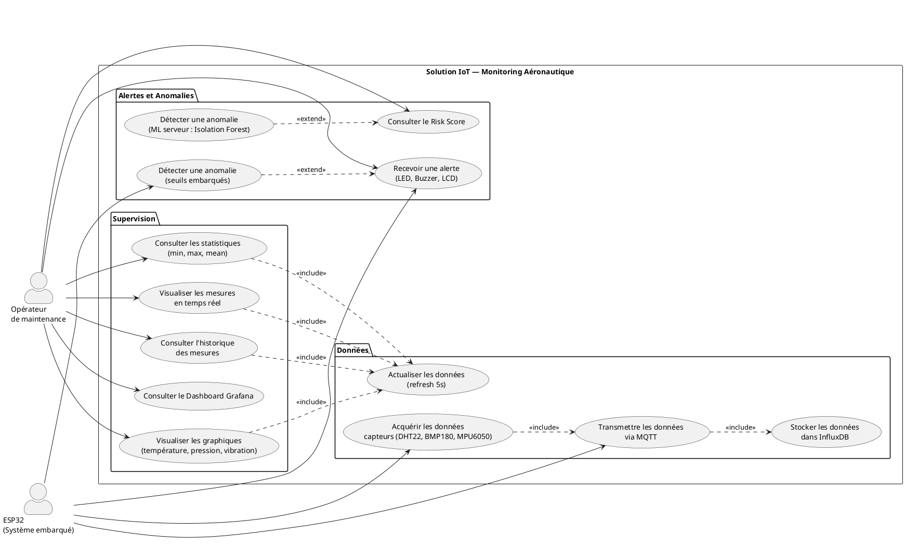
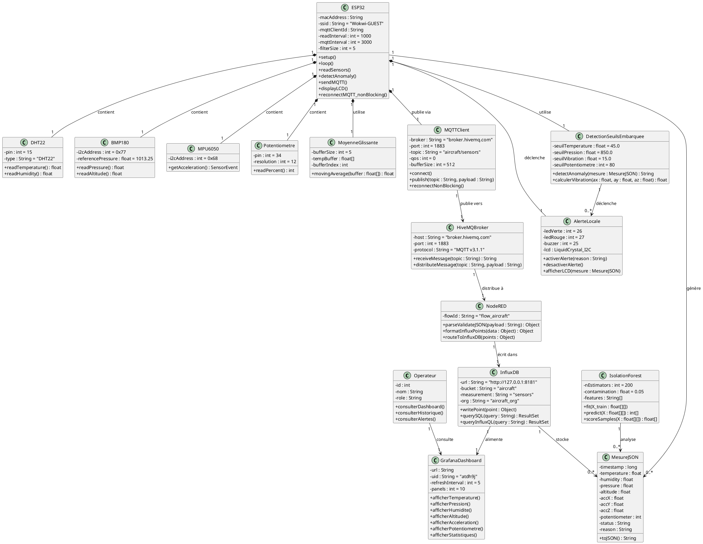
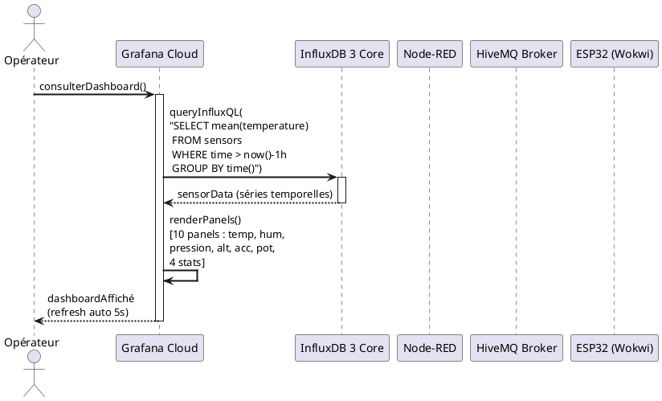
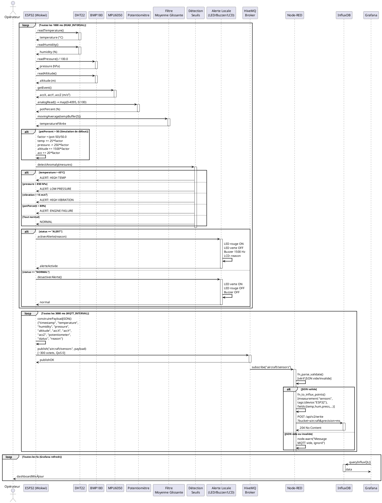
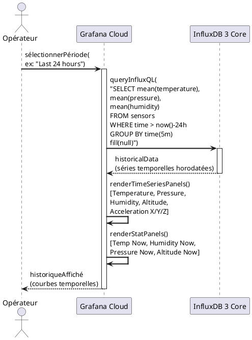
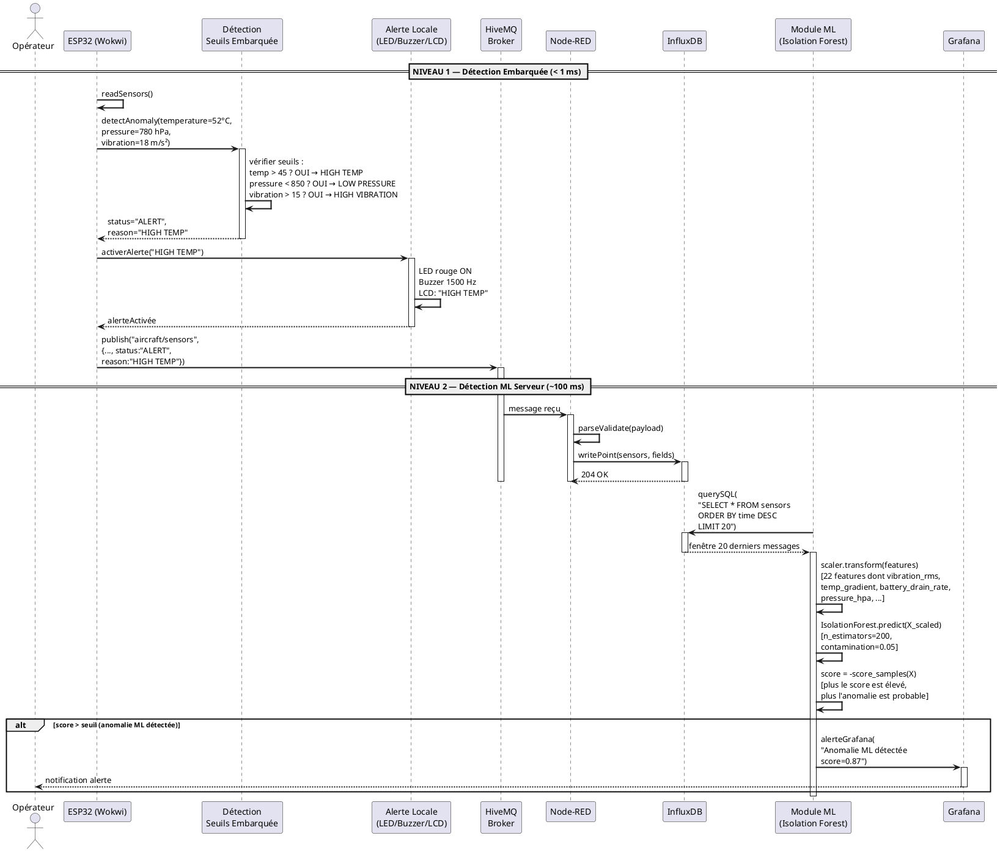
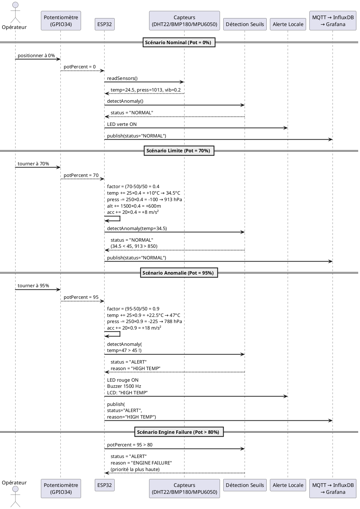
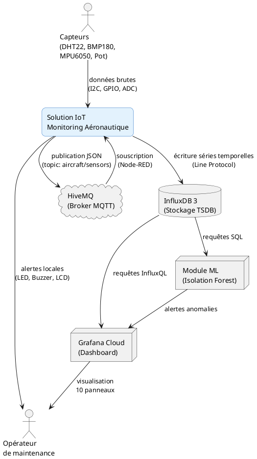

# Diagrammes UML — Projet PFE IoT Aéronautique
## Nourhen KHELIFI — YaneCode Digital — Été 2026

> Tous les diagrammes ci-dessous sont adaptés à l'architecture réelle du projet :
> **ESP32 (Wokwi) → MQTT (HiveMQ) → Node-RED → InfluxDB 3 Core → Grafana Cloud**

---

## 1. Diagramme de cas d'utilisation

---

## 2. Diagramme de classes

---

## 3. Diagramme de séquence — Consultation du Dashboard

---

## 4. Diagramme de séquence — Acquisition et transmission en temps réel

---

## 5. Diagramme de séquence — Consultation de l'historique

---

## 6. Diagramme de séquence — Détection d'anomalie complète (Embarqué + ML Serveur)

---

## 7. Diagramme de séquence — Simulation de défaut via potentiomètre

---

## 8. Diagramme de contexte

---

## Notes sur les corrections apportées

| Élément original | Correction | Justification |
| :--- | :--- | :--- |
| `SQLiteDatabase` | **InfluxDB 3 Core** | Le projet utilise une base de données time series, pas SQLite |
| `Dashboard` (générique) | **Grafana Cloud** (uid: atdh9j, 10 panels) | Dashboard réel du projet |
| `User` (générique) | **Opérateur de maintenance** + **ESP32** | Deux acteurs distincts dans le système |
| `Sensor` (générique) | **DHT22, BMP180, MPU6050, Potentiomètre** | Capteurs spécifiques avec GPIO/I2C réels |
| `ExportService` | **Supprimé** | Fonctionnalité non implémentée dans le projet |
| `ChartService` | **Intégré dans Grafana** | La visualisation est gérée nativement par Grafana |
| `Alert` (générique) | **AlerteLocale** (LED GPIO26/27, Buzzer GPIO25, LCD I2C) | Composants matériels réels |
| `Anomaly` (générique) | **DetectionSeuilsEmbarquée** + **IsolationForest** | Détection à deux niveaux (Edge + Serveur) |
| `Statistics` (classe) | **Intégré dans les requêtes InfluxQL** (mean, min, max) | Calculé par InfluxDB/Grafana |
| Séquence toutes les 5s | **READ=1000ms, MQTT=3000ms, Grafana refresh=5s** | Intervalles réels du firmware |
| `saveAlert()` dans DB | **LED/Buzzer/LCD + MQTT publish** | Les alertes sont locales + transmises via MQTT |
| Topic MQTT absent | **aircraft/sensors** | Topic réel du projet |
| Format JSON absent | **{timestamp, temperature, humidity, pressure, altitude, accX, accY, accZ, potentiometer, status, reason}** | Payload JSON réel (~300 octets) |
